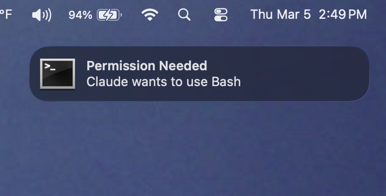

# Claude Needs You

Native OS notifications when Claude Code needs your attention.



## The problem

You're deep in your browser, reviewing docs or a PR, and Claude has been sitting in a background terminal for five minutes waiting for you to approve a tool use. Or you kicked off three agents in separate tabs and one finished two minutes ago while you were watching another. Or Claude asked a question and you never saw it.

Every minute Claude sits idle is a minute of dev time wasted. If you're running agents in parallel across multiple windows, the problem multiplies — there's no built-in way to know which session needs you right now.

## The fix

**Claude Needs You** sends a native desktop notification the moment Claude is waiting for you. It fires on:

- **Permission prompts** — Claude needs you to approve a tool use
- **Questions/dialogs** — Claude is asking for input or a choice
- **Idle prompts** — Claude has been waiting and you haven't responded
- **Task completion** — Claude finished and is ready for your next prompt

Notifications are **only sent when your terminal is not focused** — no spam when you're already looking at Claude. On iTerm2 and Terminal.app, detection is per-tab, so you'll only get notified about the sessions you're not actively watching.

## Install

### From marketplace (recommended)

```bash
# Add the marketplace (one-time)
claude plugin marketplace add jovonbuilds/claude-plugins

# Install the plugin
claude plugin install claude-needs-you@jovonbuilds
```

### Manual

```bash
git clone https://github.com/jovonbuilds/claude-needs-you.git ~/.claude/plugins/claude-needs-you
claude --plugin-dir ~/.claude/plugins/claude-needs-you
```

### Update

```bash
claude plugin update claude-needs-you@jovonbuilds
```

Your settings in `~/.config/claude-needs-you/config.json` are kept — they live outside the plugin directory.

### Optional: click-to-focus (macOS)

Install `terminal-notifier` for clickable notifications that jump you to the right terminal tab:

```bash
brew install terminal-notifier
```

Without it, notifications still work via `osascript` but clicking them does nothing.

### Prerequisites

- **jq** — used to parse hook JSON (`brew install jq` / `apt install jq`)
- macOS, Linux, or Windows (Git Bash / MSYS2 / Cygwin)

## Configuration

Run `/claude-needs-you` inside Claude Code to open the interactive settings menu. This runs a shell script directly — no tokens used.

Settings are saved to `~/.config/claude-needs-you/config.json`.

### Settings

| Setting | Values | Default |
|---------|--------|---------|
| `mode` | `all`, `notification`, `stop`, `off` | `all` |
| `sound` | macOS sound name or `none` | `default` |
| `debug` | `true` / `false` | `false` |

**mode:**
- **`all`** — notify on both Claude finishing (`Stop`) and explicit notifications (`Notification`, `PermissionRequest`)
- **`notification`** — only permission prompts, idle prompts, and dialogs
- **`stop`** — only when Claude finishes responding
- **`off`** — disable all notifications

**sound** — any macOS system sound: `default`, `Basso`, `Blow`, `Bottle`, `Frog`, `Funk`, `Glass`, `Hero`, `Morse`, `Ping`, `Pop`, `Purr`, `Sosumi`, `Submarine`, `Tink`, or `none` for silent.

**debug** — when `true`, writes a log to `/tmp/claude-needs-you.log`.

### Environment variable overrides

Power users can override config file settings with environment variables. These take precedence:

| Variable | Overrides |
|----------|-----------|
| `CLAUDE_NOTIFY` | `mode` |
| `CLAUDE_NOTIFY_SOUND` | `sound` |
| `CLAUDE_NOTIFY_DEBUG` | `debug` (use `1`) |

## Platform support

### Notifications

| OS | Method | Requirements |
|----|--------|-------------|
| macOS | `terminal-notifier` or `osascript` | None (`terminal-notifier` optional via Homebrew) |
| Linux | `notify-send` | `libnotify` (`sudo apt install libnotify-bin`) |
| Windows | PowerShell toast notifications | Windows 10+ (Git Bash, MSYS2, or Cygwin) |

### Focus detection

Only notifies when the terminal running Claude is **not** the active window/tab.

| OS | Method | Granularity |
|----|--------|-------------|
| macOS — iTerm2 | AppleScript TTY comparison | Per-tab |
| macOS — Terminal.app | AppleScript TTY comparison | Per-tab |
| macOS — VS Code, Warp, Ghostty, Alacritty, Kitty, Hyper | System Events frontmost app | Per-app |
| Linux (X11) | `$WINDOWID` vs `xdotool getactivewindow` | Per-window |
| Linux (Wayland) | Not supported | Always notifies |
| Windows | `GetForegroundWindow` vs `GetConsoleWindow` | Per-window |

### Click-to-focus (macOS, requires `terminal-notifier`)

| Terminal | Behavior |
|----------|----------|
| iTerm2 | Activates the exact tab running Claude |
| Terminal.app | Activates the exact tab running Claude |
| VS Code, Warp, Ghostty, Alacritty, Kitty, Hyper | Activates the app |

### Making notifications stick around (macOS)

By default, macOS notifications appear as **Banners** that auto-dismiss after about 5 seconds. If you're stepping away or running long tasks, you probably want them to stay on screen until you click them.

macOS controls this at the system level — apps can't set it themselves. To switch to persistent notifications:

1. Open **System Settings > Notifications**
2. Find **terminal-notifier** in the app list (or **Terminal** / **iTerm2** if you don't have terminal-notifier installed)
3. Change the alert style from **Banners** to **Alerts**

Alerts stay on screen until you dismiss or click them, so you won't miss a notification even if you're away from your desk.

> **Note:** The app won't appear in the Notifications list until it sends its first notification. Run Claude, trigger a notification, then go to System Settings.

## How it works

Uses Claude Code's [hooks system](https://code.claude.com/docs/en/hooks) to listen for three events:

1. **`PermissionRequest`** — fires when Claude needs tool approval
2. **`Notification`** — fires on idle prompts, dialogs, and auth events
3. **`Stop`** — fires when Claude's turn ends and it's waiting for input

A single shell script (`scripts/notify.sh`) reads the hook JSON, checks if the terminal is focused, and fires a native OS notification if not.

```
claude-needs-you/
├── .claude-plugin/plugin.json           # plugin manifest
├── .github/workflows/ci.yml            # CI: ShellCheck, JSON, smoke tests
├── assets/                              # screenshots
├── hooks/hooks.json                     # hook event registrations
├── scripts/notify.sh                    # notification logic
├── scripts/check.sh                     # local pre-push checks
├── skills/claude-needs-you/SKILL.md     # /claude-needs-you command
├── LICENSE
└── README.md
```

## Contributing

Issues and PRs welcome. If you use a terminal not listed above, open an issue with:
- Your `TERM_PROGRAM` value (`echo $TERM_PROGRAM`)
- Your OS and terminal name
- The app's process name in System Events (macOS) or bundle ID

## License

MIT
